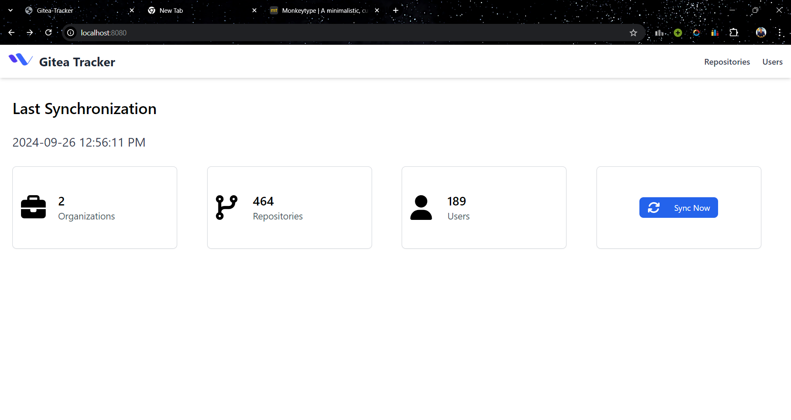
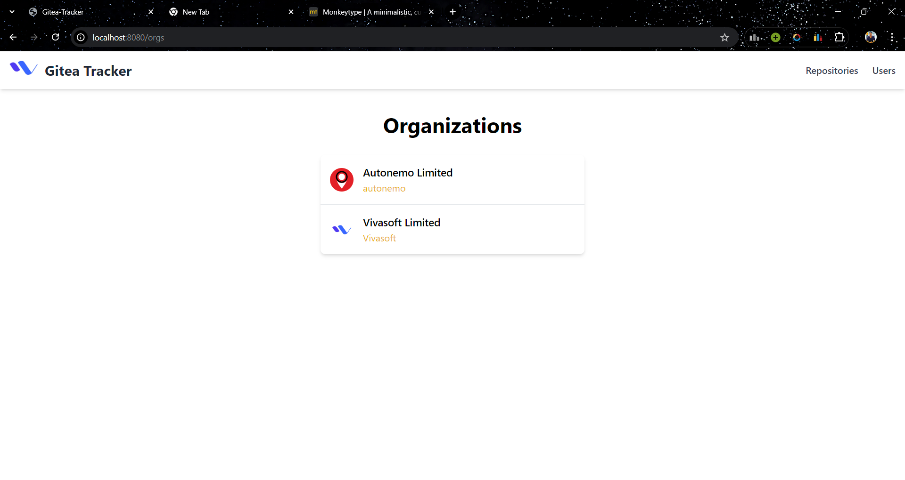
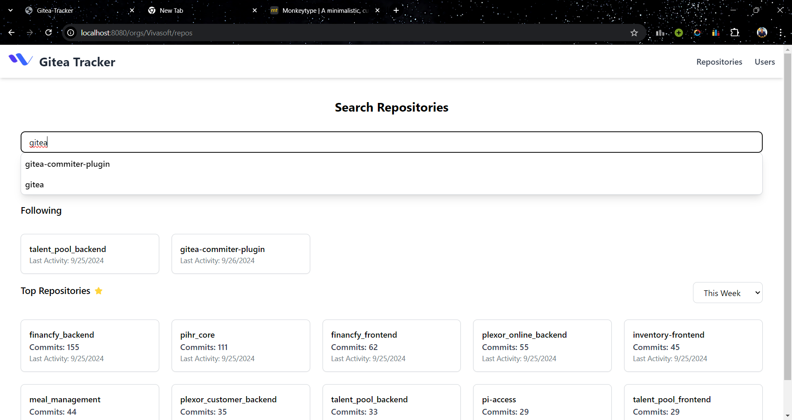
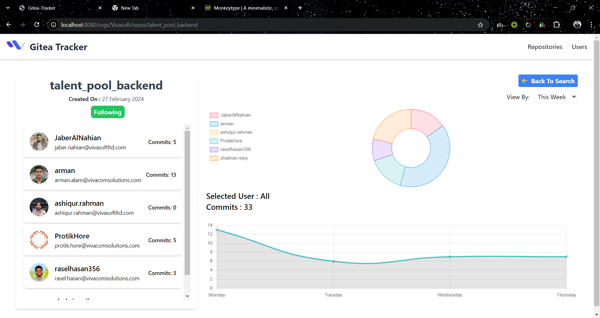
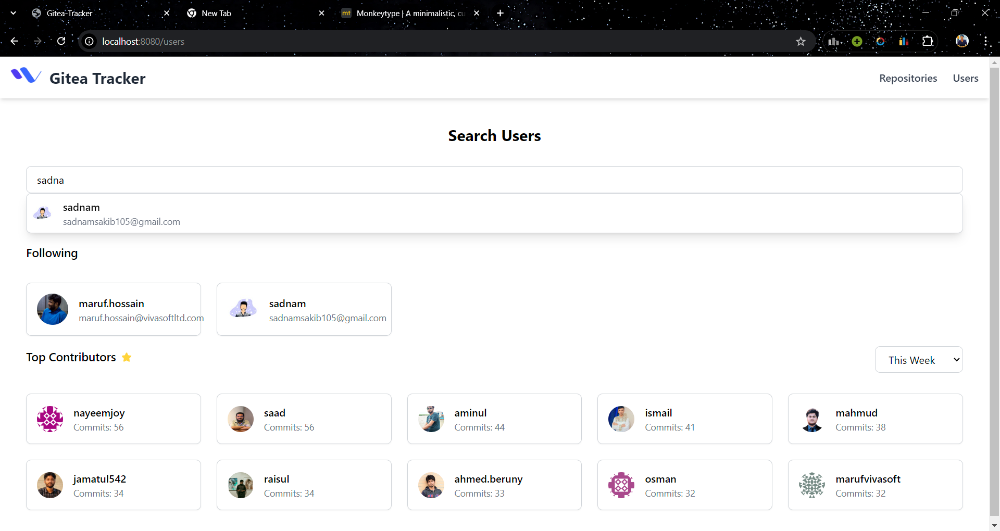
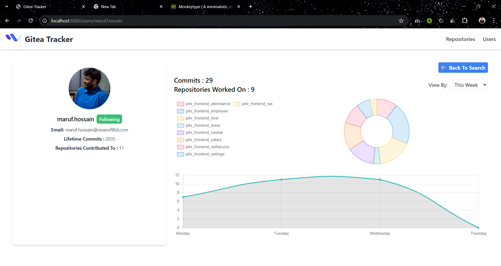

# Gitea-Tracker

**Gitea-Tracker** is a lightweight web application developed using the [Go Echo Framework](https://echo.labstack.com/), [Go Templ](https://templ.guide/) for template rendering, and [Tailwind CSS](https://tailwindcss.com/) for styling. The project follows an MVC (Model-View-Controller) approach to separate concerns and make development more scalable and maintainable.

## Table of Contents
- [Project Overview](#project-overview)
- [Tech Stack](#tech-stack)
- [Project Structure](#project-structure)
- [Installation](#installation)
- [Usage](#usage)
- [Routes](#routes)

## Project Overview
**Gitea-Tracker** is a simple, web-based application designed to track commit frequency in [Gitea](https://gitea.io/) Vivasoft organization. It helps the organization to track the commit frequency of developers and repositories, follow/unfollow users and repositories, and view user profiles and activities.

## Tech Stack
- **Backend Framework**: Go Echo
- **Templating Engine**: Go Templ
- **Frontend Styling**: Tailwind CSS
- **Language**: Golang (Go)

## Project Structure
The project follows an MVC (Model-View-Controller) architecture, which divides the responsibilities of the application into different layers. Here's the basic structure:
```
./
├── cmd/                     # Contains the entry point for the application
│   └── gitea-committer/     # Main application command
│       └── main.go          # The entry point for the server
├── configs/                 # Configuration files (e.g., credentials)
│   └── config.json          # Contains database and Gitea credentials
├── internal/                # Core application logic
│   ├── app/                 # Application logic
│   │   ├── controller/      # Controllers that handle HTTP requests and responses
│   │   ├── middleware/      # Custom middlewares for request handling
│   │   ├── router/          # Routes that map URLs to controllers
│   │   └── service/         # Business logic and services used by controllers
│   ├── config/              # Configuration management logic
│   │   └── config.go        # Loads the configuration from config.json
│   ├── db/                  # Database connection and initialization
│   │   └── db.go            # Database connection setup
│   └── repository/          # Repository pattern for database interactions
├── pkg/                     # Packages with utilities and helper functions
│   ├── logger/              # Logging utilities (currently empty)
│   ├── model/               # Data models for the application
│   └── utils/               # Utility functions (currently empty)
├── scripts/                 # Scripts (currently empty)
├── templates/               # Go Templ templates for the front-end
├── web/                     # Web assets such as CSS and JavaScript
│   ├── assets/              # Static assets (e.g., images, JavaScript)
│   └── css/                 # Styling files
│       └── style.css        # Tailwind CSS and custom styling
|   └── js/                  # JavaScript files
├── docker-compose.yml       # Docker configuration for the project
├── Dockerfile               # Dockerfile to build the application container
├── go.mod                   # Go module file for managing dependencies
└── go.sum                   # Go checksum file for module versions
```

### Directory Breakdown:

- **cmd/**: Contains the main entry point of the application. The `gitea-committer/main.go` file initializes and starts the server.
- **configs/**: Holds the configuration files. In this case, `config.json` contains database and Gitea credentials.
- **internal/**: This folder holds the core logic of the application. 
  - **app/**: Contains subfolders for controllers (handle incoming requests), middleware (custom middleware functions), router (route definitions), and service (business logic).
    - **service/**: Contains the business logic and services used by the controllers.
    - **controller/**: Handles incoming HTTP requests and sends responses.
    - **middleware/**: Contains custom middleware functions for request handling.
    - **router/**: Defines the routes that map URLs to controllers.
  - **config/**: Manages configuration loading, such as loading `config.json`.
  - **db/**: Handles database connection and initialization logic.
  - **repository/**: Implements the repository pattern to interact with the database and execute queries.
- **pkg/**: Contains additional packages that support the application, including logger utilities, models for database interactions, and general utilities.
- **templates/**: Contains Go Templ files and the generated Go files, which are used to render HTML pages.
- **web/**: Holds static assets, including Tailwind CSS files and custom styles located in `style.css`.
- **docker-compose.yml**: Docker Compose file for setting up containerized development.
- **Dockerfile**: Instructions for building the Docker container for the application.

## Installation
To install and run **Gitea-Tracker**, follow these steps:

1. Clone the repository:
    ```bash
    git clone https://gitea.vivasoftltd.com/Vivasoft/gitea-commiter-plugin.git
    ```

2. Navigate into the project directory:

3. Install dependencies:
    ```bash
    go mod tidy
    ```
    ```bash
    templ generate
    ```
    ```bash
    npm install
    ```
    ```bash
    npm run build:css
    ```

4. Run the application:
    ```bash
    go run ./cmd/gitea-committer/main.go
    ```
5. Or run the application using Docker after step 2:
    ```bash
    docker-compose up --build
    ```

6. Open your browser and go to `http://localhost:8080` to access the application.

## Usage
After starting the application, you can access the following routes:

### Routes

| **Method** | **Route**                                        | **Description**                                      |
|------------|--------------------------------------------------|------------------------------------------------------|
| `GET`      | `/api/orgs/`                                     | Get all organizations from the database              |
| `GET`      | `/api/orgs/:org/repos/search`                    | Search repositories within a specific organization   |
| `GET`      | `/api/orgs/:org/repos`                           | Get all repositories of a specific organization      |
| `GET`      | `/api/orgs/:org/repos/:repo/users`               | Get all users of a specific repository               |
| `GET`      | `/api/orgs/:org/repos/:repo/users/search`        | Search users within a specific repository , takes in a "query" parameter           |
| `POST`     | `/api/orgs/:org/repos/:repo/follow`              | Follow a specific repository                         |
| `POST`     | `/api/orgs/:org/repos/:repo/unfollow`            | Unfollow a specific repository                       |
| `GET`      | `/api/sync/orgs`                                 | Sync all organizations                              |
| `GET`      | `/api/sync/users`                                | Sync all users                                      |
| `GET`      | `/api/sync/activities`                           | Sync all activities                                 |
| `GET`      | `/api/sync/repos`                                | Sync all repositories                               |
| `GET`      | `/api/sync/newActivity`                          | Sync new activity                                   |
| `WEBSOCKET`      | `ws://localhost:8080/api/sync/dailySync`                            | Perform a daily sync                                |
| `WEBSOCKET`      | `ws://localhost:8080/api/sync/totalSync `                           | Perform a total sync                                |
| `GET`      | `/api/users/`                                    | Get all users                                       |
| `GET`      | `/api/users/search`                              | Search users , takes a "query" parameter                                       |
| `GET`      | `/api/users/:username`                           | Get details of a specific user                      |
| `GET`      | `/api/users/:username/activities`                | Get user activities by date range  , takes "start_date" , "end_date" , "count_only" , "repo"                |
| `POST`     | `/api/users/:username/follow`                    | Follow a specific user                              |
| `POST`     | `/api/users/:username/unfollow`                  | Unfollow a specific user                            |
| `GET`      | `/`                                              | Render home page                                    |
| `GET`      | `/orgs`                                          | Render organizations page                           |
| `GET`      | `/orgs/:org/repos`                               | Render repositories page for a specific organization|
| `GET`      | `/users`                                         | Render users page                                   |
| `GET`      | `/users/:user`                                   | Render user profile page                            |
| `GET`      | `/orgs/:org/repos/:repo`                         | Render repository page for a specific repository    |


### User Manual
1. **Home Page**: The home page displays the number of total organizations,users and repositories accross all organizations.The sync button can be used to sync all organizations,users,repositories and new activities. 



2. **Organizations Page**: The organizations page displays all organizations in the database. This page is displayed when a user clicks the repositories option on the navbar.



3. **Repositories Page**: Upon clicking an organization, the repositories page displays all repositories of the selected organization. The search bar can be used to search for repositories. The following section shows the repositories you have chosen to follow. The top repositories section shows the top repositories based on the number of commits.The duration of the commits can be changed using the dropdown.



4. **Repository Page**: Upon clicking a repository, the repository page displays the repository's details and activities. On the left we can see the name of the repository along with its creation date..The following button can be clicked to follow that repository.Below the follow button is the list of users who have contributed to this repository and the counts of their individual commits to this repository. Also,on the right side we can see a dougnut chart which shows the percentage of commits made in this repository by the users who have contributed to it.The line chart shows the number of commits made in this repository over a period of time.The duration of the commits can be changed using the dropdown.The line chart initially shows the aggregated commits made by all users in that time period but if you click on a user in the list of users who have contributed to this repository then the line chart will show the commits made by that user in that time period.



5. **Users Page**: The users page displays all users in the database. This page is displayed when a user clicks the users option on the navbar.The searchbar can be used to search for users. The following section shows the users you have chosen to follow.The top contributors section shows the top contributors based on the number of commits.The duration of the commits can be changed using the dropdown.



6. **User Profile Page**: Upon clicking a user, the user profile page displays the user's details and activities. On the left we can see the name,email and avatar of the user along with their lifetime commit count and the total repositories they have contributed to in their lifetime.The following button can be clicked to follow that user.On the right side of the page we can see a dougnut chart and a line chart. The dougnut chart shows the percentage of commits made by the user in the repositories they have contributed to.The line chart shows the number of commits made by the user in the repositories they have contributed to over a period of time.The duration of the commits can be changed using the dropdown.




